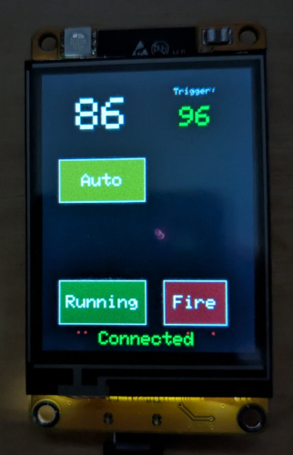
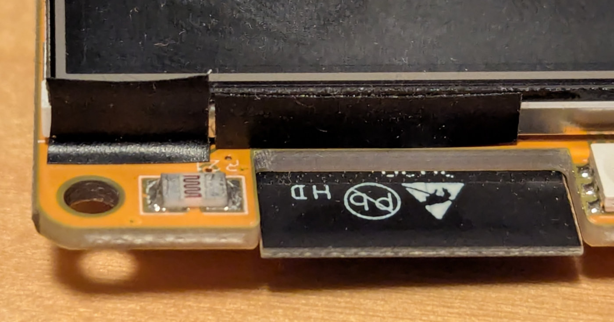

# Lightning trigger for Sony cameras using the ESP32-2432S024R

## Description

This project implements a lightning trigger, with a touchscreen UI, which can be used to trigger a Sony camera's shutter via Bluetooth Remote. 

When the received light at the 2432S024's light sensor is higher than the trigger sensitivity, the Bluetooth commands will be sent to the paired camera to fire the shutter. Hopefully that catches an image of the lightning.

In "Auto" mode (default), the sensitivity will drift to try to maintain 10 above the current reading.
In "Manual" mode, you can enter the sensitivity manually.

The 2432S024's light sensor is quite sensitive, and will max out with only a small amount of light, so you won't see the light reading go lower than 100 in anything brighter than a very dark room. There are hardware tweaks that can be done which will reduce the sensitivity, but they probably aren't relevant to this project. Just know that seeing it always read 100 in a lit room is normal. Turn off ever light and take it away from your computer's monitor to get a better result.
Also, this code does leave the backlight on at all times. There is a gap under the screen, next to the light sensor, which can spill light out from the screen to the sensor. I added some tape to block the light spill. I highly recommend doing this. Perhaps a future improvement could be to turn off the backlight when "running" and turn it back on when the user touches the scren.

Caveat: I haven't tested this with real lightning. I live on the west coast and we don't get much lightning, but I just liked the idea of it, so it became my "Learn how to program the 2432S024R project". This is much more of a hardware test than a real project meant to be useful. If you find it useful, that's great!

## Setup

In the setup() function, you'll want to change the camera name to match the name of the camera you're trying to connect with:

`    sonyBluetoothRemote.pairWith("ILCE-7CM2");`

Ideally there'd be a whole pairing UI to be able to choose this from the discovered Bluetooth devices. That's potential future work.

On the camera, in the Network / Bluetooth menu, make sure Bluetooth Function is turned on, and go into the "Pairing" menu to allow it to pair. Also make sure the Bluetooth Rmt Ctrl is set to On (otherwise it won't actually be able to trigger the shutter). 
When you start up your ESP32, it should automatically pair if not already paired. It it's been paired once, it shouldn't need to pair again, and you should be able to just turn on your camera and ESP32 and they should automatically connect. You'll see "Connected" in green text at the bottom of the screen when it's connected.

## Hardware

The ESP32-2432S024R is an ESP32 CYD ("Cheap Yellow Display") variant, with a 2.4 inch screen. It's not nearly as common as the much better researched and well understood 2.8 inch ESP32-2432S028R. Because of that, it was initially a struggle to get all of the parts of this board working correctly, especially the touch screen. In the end I found Mike Eitel's project https://github.com/MikeEitel/ESP-32_CYD_MQTT to be incredibly helpful. It was the first project I came across that successfully managed to get touch screen working on this board. Strangely I found that Mike used the ILI9341 display driver and this didn't totally work on my board (it displayed only in a 240x240 region on the display). I found that the ST7789 drivers worked perfectly, though, when paired with the Adafruit GFX library. I expect someone could probably get this working with LVGL, but after my initial failures (prior to finding Mike's project), I never tried. But perhaps if you're trying to get that to work, you might find some value in the code here.
